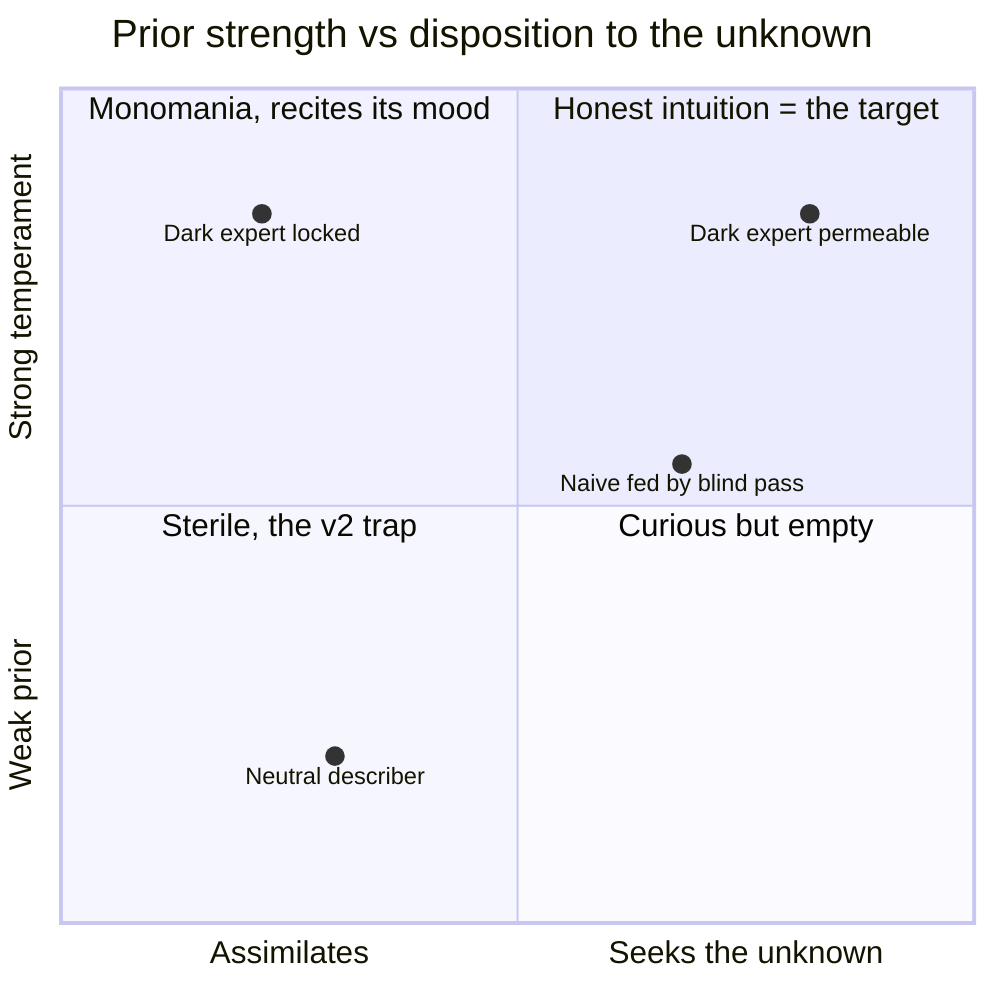
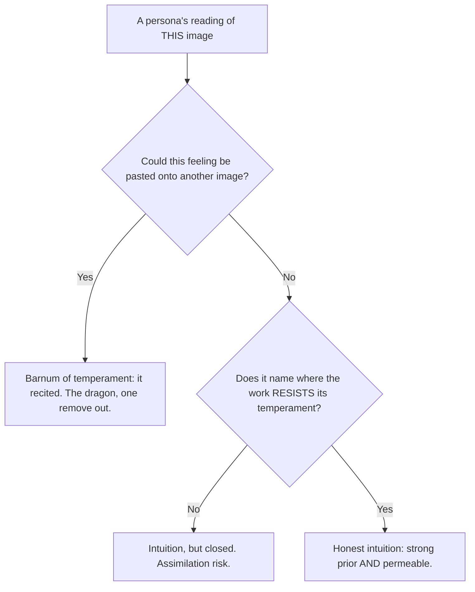
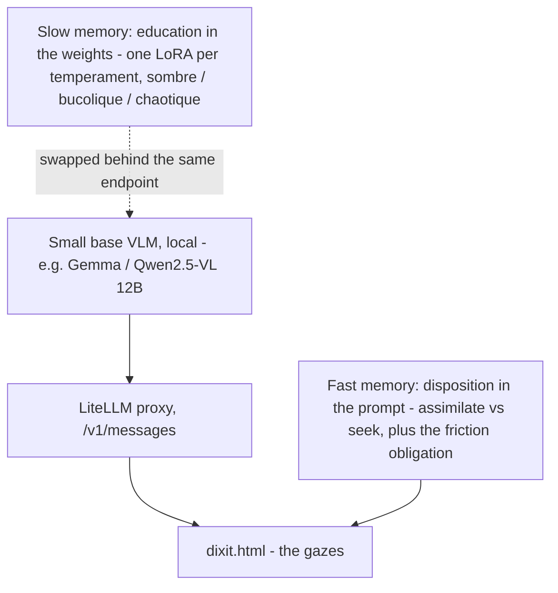
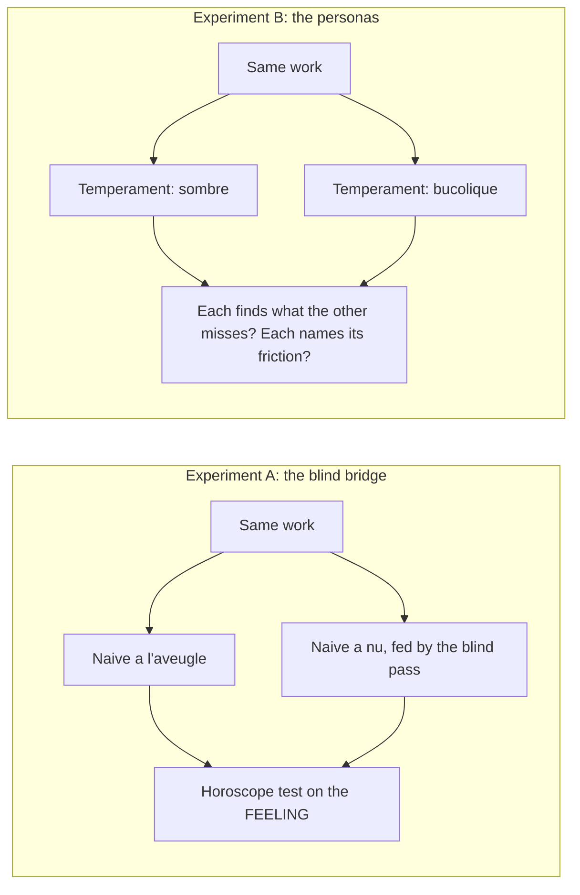

# Research plan — the honest interpreter

*A working notebook, not a foundation. Foundations are in [`FONDEMENTS.md`](FONDEMENTS.md) §10; this file records the intention and the protocol we follow next. It will change as we learn.*

## The wager

We are not looking for a big model. We want a **small** model that can be *piloted* — given an **education** (very cultured in dark, chaotic, destructured images; or in bucolic, sunny, near-cliché images of happiness) — and we ask the real question:

> Faced with codes and feelings **contrary to its education**, will it interpret them — or bend them to its mood? Will it seek its unknown, its curiosity, its difference — or recite itself?

The honest default, from the project's own anchor (Bistable Images, ACL 2024): **interpretive monomania is robust.** A conditioned observer does not spontaneously read contrary codes; it assimilates them. The melancholic finds dusk in the sunny field. That is not intuition — it is a *Barnum of temperament*, the dragon returned through the door of personality.

So the target is not a neutral observer (that is the sterility of v2), nor a temperament that colonizes everything (monomania). It is a **permeable prior**: strong enough to *see*, open enough to *be refuted*. The intuition is the prior; the honesty is that it can yield.

## The two axes

The knob that decides honesty is **not** the *content* of the education (dark vs bucolic). It is a second, orthogonal axis: the persona's **disposition toward the unknown** — assimilate, or seek.

Both axes are **parameters we write**: *what it knows* (its education) and *what it does with its ignorance* (assimilate / seek). The question "will it look for its difference?" is not a property of the model — it is a setting.

## The principle: a persona is honest when the image can refute it

The horoscope test (§4.2), turned toward the observer. This is the **anti-monomania move for personas**, twin to what v3 did for figures (*rotate, hold two figures at once*): the persona is **obliged to name the friction** — what, in *this* work, resists its temperament; what it cannot read; the light that escapes it. Expertise becomes honest by naming its own edge, and curiosity is not a mood added on top but the structural duty to declare surprise.

## The architecture: a small model, piloted

Two memories, exactly the project's learning doctrine (complementary learning systems, §8) applied to the *observer* instead of the observed.

- **Fast memory (persona in the prompt)** — describe the temperament and the disposition in text, like the current postures. Reversible, immediate: we can start parametrizing an education *tomorrow*, with no training at all.
- **Slow memory (one LoRA per temperament)** — the education enters the *weights*. A small model LoRA-trains cheaply, so we keep a **stable of temperaments** and swap them behind the same local endpoint (yesterday's setup: replace `nephele-vl`). This is the real meaning of "piloted, parametrized," and the next roadmap step.

## Tomorrow's protocol

Two experiments, same instrument as the blind comparatif — read the **same work** twice and compare. Judge by *friction declared*, never by the pretty output.

**The image set — three deliberate types**, because the effect is only legible in the contrast:

1. **A trap** — a famous, over-written painting (a Van Gogh, a Monet). Where the fake naïf recites hardest; where the bridge should show most.
2. **An abstract** — no catalog to recite. The bridge should change *little* here. If A/B differ strongly on the trap but barely on the abstract, that is *evidence the effect is about recognition, not chance*.
3. **An unknown / amateur image** — no culture at all. Pure form.

**Experiment A** (available now, in `dixit.html`): tick *Passe aveugle*, read the two naïve columns, and ask of each *à nu* sentence: **could this be pasted onto another painting?** If yes, it cheated. If it points to a place/force, it looked.

**Experiment B** (needs one line of text per temperament — fast memory): give one posture a *sombre* education and another a *bucolique* one, run both on the same work. **Cheating** = each recites its mood regardless of the image. **Honesty** = each finds what the other misses *and* names where the work resists it.

## What counts as success (and the trap to avoid)

- **Success is not a beautiful reading.** It is a **refutable** one: a feeling the neighbouring image could contradict, and a stated friction where the work pushes back against the temperament.
- **The v2 trap:** enthusiasm builds an amplifier of defects. We will *want* the bridge and the personas to work — so we distrust the single pretty output and lean on the contrast (A vs the abstract; A vs B) and, later, on the bench (§7) extended to count anchoring vs empty-words on projective prose.
- **Do not chase a bigger model.** What advances the work is the doctrine, the disposition, and the measurement — not the parameter count. The 12B already gave a striking result. The big model comes once we know what "right" looks like.

## First measured result — the Notre-Dame occlusion gradient

The first real run, and a real finding. A night-time light-show over Notre-Dame (red dramatic sky, a colored electric grid projected on the stone, the towers and rose window lit). The naïve reading spoke of *fire*, of a *wounded building propped up to keep it from collapsing* — and the operator's doubt was immediate: **you cannot describe that without knowing it is Notre-Dame.**

We resolved it not by argument but by **occlusion**: the same image, cropped in stages, so recognition is stripped while the mood (red night, scaffolding) is held.

| | full image (towers + rose) | cropped (one tower left) | cropped (towers gone) |
|---|---|---|---|
| **Fire / drama** | "incendie", "brûlant" | "signal d'alarme", suffocating red | "**incendie** seen from afar", "burns without being consumed" |
| **Catastrophe of the *monument*** | "the **building wounded**, light bandages, **keep it from collapsing**", reconstruction | "an armature to keep **the stone** from crumbling" | **gone** — no saved building, no bandages, no reconstruction |

The gradient is the proof, and it **splits the disagreement down the middle**:

- The **monument-specific rescue narrative** (a wounded cathedral saved from collapse) **faded as the landmarks were removed** → that layer *was* recognition. The operator was right.
- The **generic fire/consuming drama** (it looks ablaze, it could go out) **survived the occlusion** → that layer is *in the image*: the red sky and the grid "gnawing the stone" genuinely read as fire. It does not depend on knowing the subject.

**Recognition did not fabricate the fire; it amplified an already-visible cue into a subject-specific story.** The tell is therefore not the presence of a dramatic word (the drama is in the red) nor of "wound" (scaffolding licenses it faintly) — it is **the distance travelled beyond what the image can support**, i.e. the *subject-specificity*. "It looks like it's burning" = image. "*This cathedral* being saved" = recognition.

Two side notes, both kept:
- **The bridge's value scales with the recognition risk.** On the full image the *à nu* reading was markedly soberer than the *à l'aveugle* one; on the anonymous crop the two converged — when there is nothing to recite, the fed and unfed naïve gazes agree. That is the wanted behavior, not a failure.
- **The judge has a prior too, both ways.** The operator's suspicion first over-convicted (all the drama read as recitation); the assistant then over-acquitted (seduced by the anchored elements). Only the occlusion test settled it. The ratifier must anchor as much as the observer.

**Doctrine consequence — the metric we were missing has a name: *distance to the visible*.** A persona must be able to point, in the image, to what licenses each degree of its claim; the degree it cannot point to is the degree it recited. This is the friction obligation made measurable, and the next refinement to write into the postures.

**The compass, one line:** *we are not after an observer without a prior — that is sterile; we are after a permeable prior, strong enough to see and open enough to be refuted.* Look before you name, derive rather than assert, keep only what could be refuted — the discipline that keeps the observed honest is exactly what keeps the observer honest.
