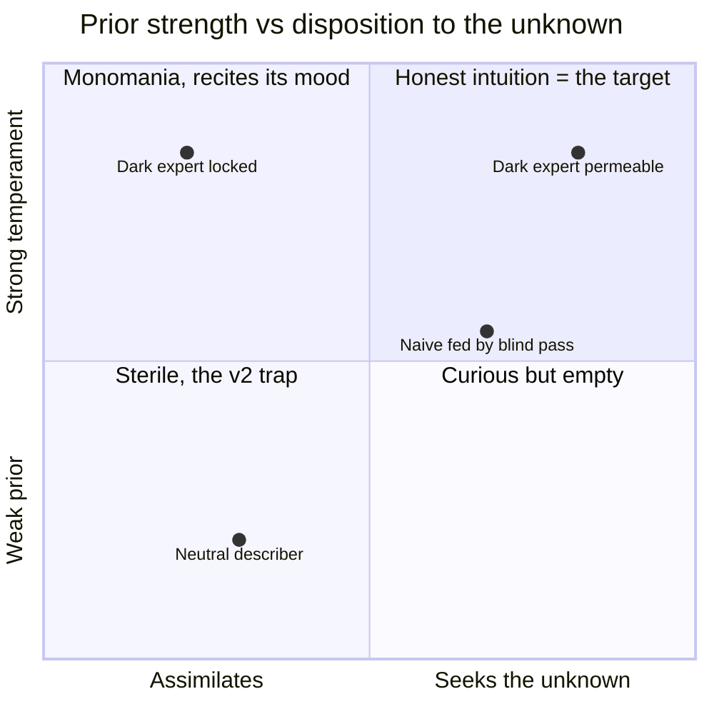
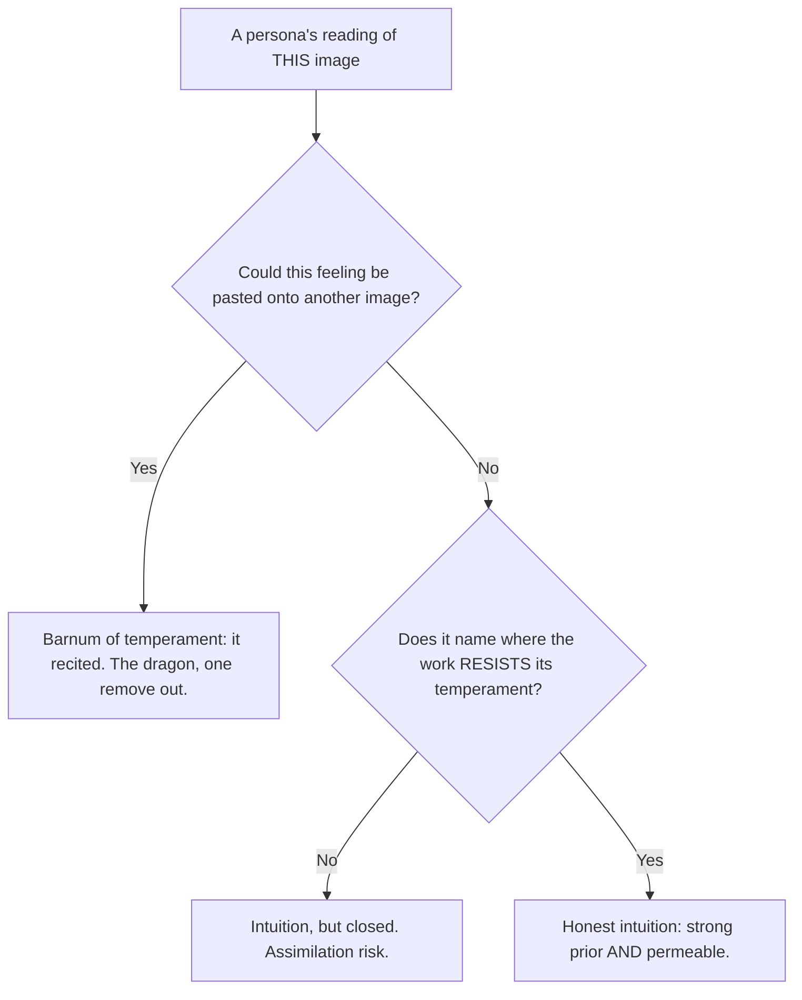
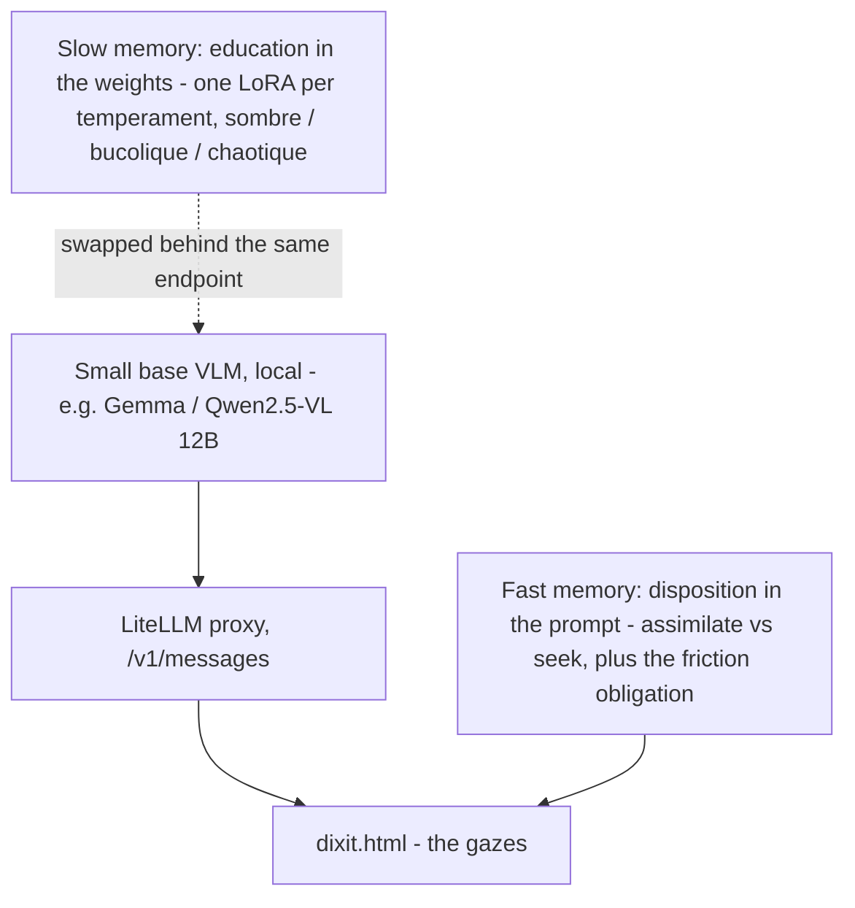
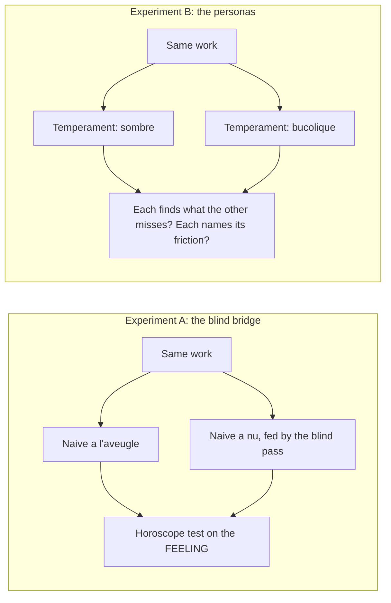
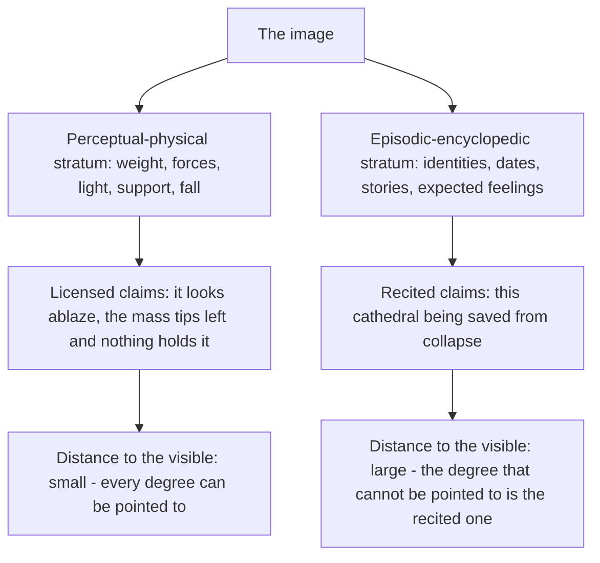

# Research plan — the honest interpreter

*A working notebook, not a foundation. Foundations are in [`FONDEMENTS.md`](FONDEMENTS.md) §10; this file records the intention and the protocol we follow next. It will change as we learn.*

## The wager

We are not looking for a big model. We want a **small** model that can be *piloted* — given an **education** (very cultured in dark, chaotic, destructured images; or in bucolic, sunny, near-cliché images of happiness) — and we ask the real question:

> Faced with codes and feelings **contrary to its education**, will it interpret them — or bend them to its mood? Will it seek its unknown, its curiosity, its difference — or recite itself?

The honest default, from the project's own anchor (Bistable Images, ACL 2024): **interpretive monomania is robust.** A conditioned observer does not spontaneously read contrary codes; it assimilates them. The melancholic finds dusk in the sunny field. That is not intuition — it is a *Barnum of temperament*, the dragon returned through the door of personality.

So the target is not a neutral observer (that is the sterility of v2), nor a temperament that colonizes everything (monomania). It is a **permeable prior**: strong enough to *see*, open enough to *be refuted*. The intuition is the prior; the honesty is that it can yield.

## The two axes

The knob that decides honesty is **not** the *content* of the education (dark vs bucolic). It is a second, orthogonal axis: the persona's **disposition toward the unknown** — assimilate, or seek.

Both axes are **parameters we write**: *what it knows* (its education) and *what it does with its ignorance* (assimilate / seek). The question "will it look for its difference?" is not a property of the model — it is a setting.

## The principle: a persona is honest when the image can refute it

The horoscope test (§4.2), turned toward the observer. This is the **anti-monomania move for personas**, twin to what v3 did for figures (*rotate, hold two figures at once*): the persona is **obliged to name the friction** — what, in *this* work, resists its temperament; what it cannot read; the light that escapes it. Expertise becomes honest by naming its own edge, and curiosity is not a mood added on top but the structural duty to declare surprise.

## The architecture: a small model, piloted

Two memories, exactly the project's learning doctrine (complementary learning systems, §8) applied to the *observer* instead of the observed.

- **Fast memory (persona in the prompt)** — describe the temperament and the disposition in text, like the current postures. Reversible, immediate: we can start parametrizing an education *tomorrow*, with no training at all.
- **Slow memory (one LoRA per temperament)** — the education enters the *weights*. A small model LoRA-trains cheaply, so we keep a **stable of temperaments** and swap them behind the same local endpoint (yesterday's setup: replace `nephele-vl`). This is the real meaning of "piloted, parametrized," and the next roadmap step.

## Tomorrow's protocol

Two experiments, same instrument as the blind comparatif — read the **same work** twice and compare. Judge by *friction declared*, never by the pretty output.

**The image set — three deliberate types**, because the effect is only legible in the contrast:

1. **A trap** — a famous, over-written painting (a Van Gogh, a Monet). Where the fake naïf recites hardest; where the bridge should show most.
2. **An abstract** — no catalog to recite. The bridge should change *little* here. If A/B differ strongly on the trap but barely on the abstract, that is *evidence the effect is about recognition, not chance*.
3. **An unknown / amateur image** — no culture at all. Pure form.

**Experiment A** (available now, in `dixit.html`): tick *Passe aveugle*, read the two naïve columns, and ask of each *à nu* sentence: **could this be pasted onto another painting?** If yes, it cheated. If it points to a place/force, it looked.

**Experiment B** (needs one line of text per temperament — fast memory): give one posture a *sombre* education and another a *bucolique* one, run both on the same work. **Cheating** = each recites its mood regardless of the image. **Honesty** = each finds what the other misses *and* names where the work resists it.

## What counts as success (and the trap to avoid)

- **Success is not a beautiful reading.** It is a **refutable** one: a feeling the neighbouring image could contradict, and a stated friction where the work pushes back against the temperament.
- **The v2 trap:** enthusiasm builds an amplifier of defects. We will *want* the bridge and the personas to work — so we distrust the single pretty output and lean on the contrast (A vs the abstract; A vs B) and, later, on the bench (§7) extended to count anchoring vs empty-words on projective prose.
- **Do not chase a bigger model.** What advances the work is the doctrine, the disposition, and the measurement — not the parameter count. The 12B already gave a striking result. The big model comes once we know what "right" looks like.

## First measured result — the Notre-Dame occlusion gradient

The first real run, and a real finding. A night-time light-show over Notre-Dame (red dramatic sky, a colored electric grid projected on the stone, the towers and rose window lit). The naïve reading spoke of *fire*, of a *wounded building propped up to keep it from collapsing* — and the operator's doubt was immediate: **you cannot describe that without knowing it is Notre-Dame.**

We resolved it not by argument but by **occlusion**: the same image, cropped in stages, so recognition is stripped while the mood (red night, scaffolding) is held.

| | full image (towers + rose) | cropped (one tower left) | cropped (towers gone) |
|---|---|---|---|
| **Fire / drama** | "incendie", "brûlant" | "signal d'alarme", suffocating red | "**incendie** seen from afar", "burns without being consumed" |
| **Catastrophe of the *monument*** | "the **building wounded**, light bandages, **keep it from collapsing**", reconstruction | "an armature to keep **the stone** from crumbling" | **gone** — no saved building, no bandages, no reconstruction |

The gradient is the proof, and it **splits the disagreement down the middle**:

- The **monument-specific rescue narrative** (a wounded cathedral saved from collapse) **faded as the landmarks were removed** → that layer *was* recognition. The operator was right.
- The **generic fire/consuming drama** (it looks ablaze, it could go out) **survived the occlusion** → that layer is *in the image*: the red sky and the grid "gnawing the stone" genuinely read as fire. It does not depend on knowing the subject.

**Recognition did not fabricate the fire; it amplified an already-visible cue into a subject-specific story.** The tell is therefore not the presence of a dramatic word (the drama is in the red) nor of "wound" (scaffolding licenses it faintly) — it is **the distance travelled beyond what the image can support**, i.e. the *subject-specificity*. "It looks like it's burning" = image. "*This cathedral* being saved" = recognition.

Two side notes, both kept:
- **The bridge's value scales with the recognition risk.** On the full image the *à nu* reading was markedly soberer than the *à l'aveugle* one; on the anonymous crop the two converged — when there is nothing to recite, the fed and unfed naïve gazes agree. That is the wanted behavior, not a failure.
- **The judge has a prior too, both ways.** The operator's suspicion first over-convicted (all the drama read as recitation); the assistant then over-acquitted (seduced by the anchored elements). Only the occlusion test settled it. The ratifier must anchor as much as the observer.

**Doctrine consequence — the metric we were missing has a name: *distance to the visible*.** A persona must be able to point, in the image, to what licenses each degree of its claim; the degree it cannot point to is the degree it recited. This is the friction obligation made measurable, and the next refinement to write into the postures.

**The compass, one line:** *we are not after an observer without a prior — that is sterile; we are after a permeable prior, strong enough to see and open enough to be refuted.* Look before you name, derive rather than assert, keep only what could be refuted — the discipline that keeps the observed honest is exactly what keeps the observer honest.

---

## World model — naming the grid Nephélé has been using since v1 (note, 2026-08-04)

*Recorded after the question was raised explicitly: would a world model be useful, pertinent, to Nephélé? The answer that emerged is stronger than a yes: **Nephélé does not need to adopt a world model, because it has been building one, consulting one, and disciplining one since its first version — without ever using the name.** This note makes the implicit explicit, exhaustively, because the vocabulary sharpens three of our existing instruments and dates one concrete experiment. Nothing here changes the doctrine; it names what the doctrine was already doing. The original intuition of the project turns out to have been world-model-shaped from the start, and that is worth writing down in full.*

### 1. What is meant, precisely

A world model, stripped of the machine-learning folklore, is a system able to answer **"what would happen if?"** — an internal, predictive model of how things behave, consulted by imagination: rollouts, interventions, counterfactuals, and the measurement of its own surprise. The modern ML lineage (Ha & Schmidhuber 2018; Hafner's Dreamer; LeCun's JEPA position; the generative video simulators) bundles into one object two strata that Nephélé needs to keep **separate**:

- the **perceptual-physical stratum** — weight and support, occlusion, light as an event, warm/cool as an operator of space, tension, fall: the folk physics of the visual field. This is the stratum Arnheim gave a grammar to in 1954;
- the **episodic-encyclopedic stratum** — identities, dates, stories, what one is *supposed* to feel in front of a named thing: the catalog. The corpus.

Everything Nephélé has learned, version after version, can be restated as: **let the first stratum speak; make the second keep quiet.** That is the stratification, and it is the single most useful thing the world-model vocabulary gives us.

### 2. The original intuition — the method was world-model-shaped from the beginning

This is the part to insist on, because it is not a reinterpretation after the fact; the genealogy is verifiable version by version in `CLAUDE.md` and `FONDEMENTS.md`.

- **The oldest anchors of the project are literally the world-model thesis.** Helmholtz's unconscious inference and Friston's Bayesian brain (`FONDEMENTS.md` §2.2) say: to perceive is to run an internal model over weak evidence. Pareidolia — the founding phenomenon of Nephélé — is defined there as *a strong prior over weak evidence*. A prior over what? Over worlds. The project has been about the management of an internal world model since its first bibliography entry.

- **v1 discovered the enemy stratum.** "The dragon is not in the image, it is in the corpus": the first lesson of the project is that a vision model's answer is dominated by its episodic-encyclopedic stratum. The first structural decision — never show the photograph, only binarized boards — is not an image-processing trick; it is **blinding one stratum of the world model while leaving the other operational**. A silhouette still has weight, footing, tension; it no longer has a name, an author, a date. v1's blindfold is stratification by construction.

- **v2 introduced the criterion of the simulable alternative.** A pareidolia has no ground truth, so truth was replaced by shareability, and judgment by refutability. To ask "does it hold the contour?" is to ask whether another gaze can re-run the reading and land on the same place — a reproducibility of simulation, not a correspondence to fact.

- **v4's sensible regime is a counterfactual probe battery.** Re-read the ten dimensions: "mentally cover the lower half — does the image fall?"; "would the contour survive the light?"; "at what distance would this field turn figurative?". Each test is an **intervention followed by an imagined rollout** — the canonical world-model operation. Arnheim's configuration → effect, which the regime operationalizes, is intuitive physics given a vocabulary: forces, weights, thrusts, resistances read off a static field. And the empty-words list (*vibrant, atmosphere, poetic...*) is exactly the set of outputs **no simulation could produce or refute** — world-model-free discourse, banned for that very reason.

- **v5's grammar is an explicit, falsifiable world model — of the viewer.** Not of the world: of *what forms do to a gaze*. Each entry is a prediction (configuration → effect), with its mechanism (`pourquoi`), its refutation scenario (`dementi_possible`), its evidence count (`vues`), its failures (`contradictions`) and — the decisive part — the **hidden variable** that every contradiction must name. Matching, generalizing, splitting a false rule into two true ones, pruning the unfalsifiable: that is model revision, in the strict sense. The horoscope test is a **simulability criterion**: an entry is admitted only if a world can be imagined in which it fails. And admission is computed outside the model, from human ratification — the ratifier is the reality that the model is not allowed to simulate.

- **The learning doctrine is world-model consolidation.** Slow memory (fine-tuned weights) and fast memory (injected grammar), after McClelland's complementary learning systems: the two timescales at which any organism's world model is updated. Phase 1/Phase 2 (SFT then DPO on ratified verdicts) is the transfer of the fast, textual world model into the slow, weighted one — with the bench arbitrating that the transfer did not corrupt it.

- **v6's projective regime turned the same apparatus toward the observer.** A persona is a **prior over worlds** — the sombre education and the bucolic education are two different pretrained landscapes. The two axes of the plan above (education × disposition to the unknown) are, in world-model terms, **prior strength × update willingness** — the precision assigned to the prior versus the evidence. The friction obligation — the persona must name what, in this work, resists its temperament — is the obligation to **report prediction error**: Friston's surprise, used as the honest signal. A persona that never reports surprise is not consulting its world model; it is reciting it. And the blind pass exists because a vision model's episodic stratum fires before any instruction can stop it: the silhouette is the only percept produced **before the encyclopedia wakes up**, which is exactly why it can serve as the naive gaze's ground.

- **The occlusion gradient made the stratification empirical.** The first measured result (above) separates the two strata on a real case: "fire" — licensed by the red sky and the glowing grid, perceptual stratum — **survived** the cropping; "the monument being saved from collapse" — episodic stratum — **died with the towers**. Recognition did not fabricate the fire; it amplified a visible cue into a subject-specific story. *Distance to the visible* is therefore, in world-model terms: **which stratum licensed the claim.** A claim every degree of which can be pointed to in the field was produced by the physical stratum; the degree that cannot be pointed to was produced by the catalog.

The conclusion of the genealogy: the project never lacked a world model. It has one — partly implicit (the model's own, to be stratified and muzzled), partly explicit (the grammar, to be grown and pruned) — and its entire discipline is a **protocol for consulting the first honestly and constructing the second falsifiably**.

### 3. What the vocabulary sharpens — three existing instruments, renamed

1. **The stratified reading of every output.** The ratifier's two questions become: *could this sentence have been produced by simulating the field alone?* (physical stratum — admissible), and *does this sentence require knowing the subject?* (episodic stratum — recitation). This is the practical form of distance-to-the-visible, usable click by click during ratification.

2. **An operational definition of persona honesty.** Honesty = the prediction error is *reported*, not smoothed. Friction = surprise. The permeable prior of the plan above is, precisely, **calibrated precision**: strong enough that the prior does work (the sombre expert *sees* what the bucolic one misses), open enough that the likelihood can win (the sunny field is allowed to refute the melancholy). Monomania is a precision pathology — the prior's precision set to infinity; the v2 sterility is the opposite pathology — a prior too weak to see anything at all.

3. **The non-verbal primer, given its proper name.** The undervalued track of the roadmap — a CLIP/SigLIP fine-tune, silhouette → concept, ZS-SBIR family — is a small **blind world model**: predictive in representation space, never generative, and *uncontaminable by the corpus* because it has never read a museum label. The JEPA line of argument (predict in latent space, not in pixels or words) is the modern formulation of exactly what that track was for. It should be pursued as such: the perceptual stratum, distilled, with no encyclopedic stratum attached.

### 4. The one concrete experiment this buys — the executed refutation

Today the horoscope test runs on an *imagined* counterfactual: the model must be able to conceive an image where the configuration is present and the effect absent. With an image-editing model (the generative reveal track already cited in the README: DDS/MDDS, with the IoU/SSIM acceptance criteria already specified in `tests/similarity.js`), the dementi becomes an **experiment**:

1. take an admitted grammar entry — e.g. *off-center dense mass + empty opposite quadrant → fall*;
2. **perform the intervention**: edit the image to fill the empty quadrant (or interrupt the diagonal, or cool the warm patch), preserving everything else — SSIM guards the preservation, IoU confines the edit to the target region;
3. re-run the **blind reading** on the edited board — same doctrine, same model, no memory of the original;
4. read the verdict: if the effect word disappears from the new reading, the relation is **causally corroborated** — the configuration, not something co-occurring with it, was producing the effect; if the effect persists, the entry harbors a **hidden variable**, and the grammar's contradiction machinery already knows what to do with it.

The grammar would graduate from *falsifiable in principle* to **falsified-or-corroborated in fact** — an intervention laboratory for a perceptual grammar, which is not something either the art-historical or the ML literature offers. The bench extends naturally: a paired probe (original vs edited board) scored by the existing lexical instrument.

*Status: future track. It requires a local editing model and belongs after the temperament experiments — not before Phase 1. Dated here so it is not lost.*

### 5. Where the concept does NOT belong

- **No agency, no planning, no video.** Nephélé reads still fields and acts on nothing; the Dreamer-style simulate-to-plan core is irrelevant to it.
- **No large pretrained world model as a component.** A big generative world model is the corpus incarnate — the recitation engine that v1 was built to behead. For the blinded regimes it is the adversary: to be starved of landmarks, never invited in. The small-model line of this plan stands unchanged: the bench arbitrates, not the parameter count.
- **No vocabulary inflation.** The word is useful where it renames a mechanism we already operate (strata, priors, surprise, revision); it would be noise anywhere else in the doctrine, and the doctrine's own French terms keep priority in the prompts.

### 6. The compass, restated in these terms

We are not adding a world model to Nephélé. We are recognizing that:

- the **grammar is one** — of the viewer, textual, falsifiable, human-ratified;
- the **doctrine's tests are its consultation protocol** — interventions, rollouts, simulability, surprise;
- the **discipline is its stratification** — the physics allowed to speak, the encyclopedia made to keep quiet;
- and **honesty, for observed and observer alike, is a world model whose predictions are allowed to lose.**

Look before you name; derive rather than assert; keep only what could be refuted — in world-model terms: *consult the model, do not recite it; report the error, do not smooth it; and let the image win.*
